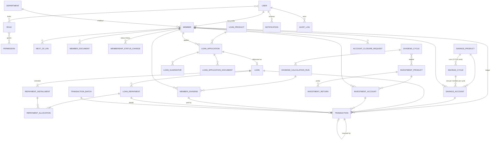

# EMDI Cooperative Management System — Architecture

**EMDI Cooperative Society** · Engineering Materials Development Institute (EMDI) · NASENI

| | |
|---|---|
| Document | Phase 1 — System architecture, database schema, entity relationships, folder structure, business rules |
| Status | Draft for review |
| Date | 2026-09-30 |
| Stack | Django 5.2 LTS · Django REST Framework · PostgreSQL 15+ · SimpleJWT · React 18 + Vite · Tailwind CSS |

This document is the reference for every later phase. Later phases implement what is written here; any change to it should be made here first.

---

## Contents

0. [Starting point: the existing codebase](#0-starting-point-the-existing-codebase)
1. [System architecture](#1-system-architecture)
2. [Core design decisions](#2-core-design-decisions)
3. [Roles and permissions](#3-roles-and-permissions)
4. [Database schema](#4-database-schema)
5. [Entity relationships](#5-entity-relationships)
6. [Workflows and state machines](#6-workflows-and-state-machines)
7. [API structure](#7-api-structure)
8. [Backend folder structure](#8-backend-folder-structure)
9. [Frontend folder structure](#9-frontend-folder-structure)
10. [Business rules](#10-business-rules)
11. [Security model](#11-security-model)
12. [Go-live data migration](#12-go-live-data-migration)
13. [Phase plan](#13-phase-plan)
14. [Open questions](#14-open-questions)

---

## 0. Starting point: the existing codebase

The repository already holds a general-purpose cooperative app ("CoopManager Pro" / BravEdge). I reviewed it against the EMDI requirements. Its foundations conflict with several core EMDI rules, so it cannot be extended safely.

| Area | What exists | Conflict with EMDI requirements |
|---|---|---|
| Savings | One `SavingsAccount` per member with a mutable `balance` column. `SavingsTransaction` has a `WITHDRAWAL` type. | No savings products. Christmas Savings cannot be kept separate. The balance is not derived from a ledger. Withdrawal exists. |
| Deletion | Financial FKs use `on_delete=CASCADE` (member → loans, savings, repayments) | Deleting a member deletes their financial history (breaks BR-13) |
| Roles | `CustomUser.role` is a single hard-coded `CharField`. Views check role lists written as strings. | Roles can't be configured, and a user can't be both an officer and a member (officers usually are members) |
| Numbering | `membership_id` is built from the latest record's number + 1. Account numbers are random. | Two members created at the same moment can get the same number |
| Loans | Application and loan are one model. Interest ignores the loan term. The balance is changed directly. There is no repayment schedule. | No application workflow, no schedule, no ledger trail |
| Data isolation | Each viewset decides for itself whether the caller is an officer or a member, and filters accordingly | Officer and member data share the same endpoints, so one missed filter leaks data |
| Migrations | `.gitignore` excludes 8 migration files (e.g. `loans/0002_loan_loan_id.py`) | A fresh clone cannot rebuild the schema |
| Settings | `TIME_ZONE='UTC'`. DB password and `SECRET_KEY` fallbacks are hard-coded. `ALLOWED_HOSTS` includes `*`. `DEBUG` defaults to `True`. | Month boundaries for contributions come out wrong. The defaults are insecure. |
| Scope | `shares`, `contributions` (dues/levies/fines) and `finance` (income/expense) apps. A stray `backend/accounts/` app. One-off scripts (`final_fix.py`, `fix_savings.py`). | Not in the EMDI scope. **Removed in Phase 2** (Q3 answered). |

**Recommendation.** In Phase 2, replace `backend/apps/` with the app set below and start a fresh migration history. Keep:

- the repository and its git history
- the Docker/Render deployment tooling and WhiteNoise
- the frontend toolchain: Vite, Tailwind, Recharts, axios, react-hook-form, lucide-react, date-fns

Frontend pages will be rebuilt against the new API, using the two-layout structure. **This assumes no production data in the currently deployed database needs to be kept (Q1).**

---

## 1. System architecture

```
                    ┌──────────────────────────────────────────────┐
                    │           React SPA (Vite build)             │
                    │  /admin/*  Officer portal (AdminLayout)      │
                    │  /member/* Member portal  (MemberLayout)     │
                    │  /login, /activate, /reset-password          │
                    └───────────────┬──────────────────────────────┘
                                    │ HTTPS · JSON · Bearer access token
                                    │ (refresh token in httpOnly cookie)
                    ┌───────────────▼──────────────────────────────┐
                    │         Django + DRF  (/api/v1)              │
                    │                                              │
                    │  /auth/*   authentication, password, tokens  │
                    │  /me/*     member self-service  (scoped to   │
                    │            request.user — never takes an id  │
                    │            of another member)                │
                    │  /admin/*  officer API (permission-checked)  │
                    │                                              │
                    │  views → serializers → services → models     │
                    │                  ↘ selectors (reads)         │
                    │  services write: ledger + audit log, atomic  │
                    └───────────────┬──────────────────────────────┘
                                    │
                    ┌───────────────▼──────────────────────────────┐
                    │  PostgreSQL                                  │
                    │  constraints · partial unique indexes        │
                    │  append-only triggers on ledger & audit log  │
                    └──────────────────────────────────────────────┘
        Media storage (member photos/documents, loan attachments): local disk in dev, S3-compatible in prod
```

### Layering inside the backend

| Layer | Responsibility | Rule |
|---|---|---|
| **Models** | Schema, DB constraints, simple invariants | No cross-model business logic in `save()` |
| **Services** (`services.py`) | Every state-changing business operation, e.g. `post_contribution()`, `approve_loan()`, `calculate_dividends()` | The **only** code that writes financial records. Each call runs inside `transaction.atomic()`, locks rows it depends on (`select_for_update`), writes the ledger entry and the audit log in the same transaction. |
| **Selectors** (`selectors.py`) | Read queries and aggregations (balances, dashboards, reports) | Member selectors always take a `member` argument. There is no unscoped member query. |
| **Serializers** | Input validation, output shape | Separate `admin` and `member` serializers. Member serializers never expose internal notes or officer fields. |
| **Views** | HTTP, permissions, pagination, filtering | Thin: they validate, call one service or selector, and return the result |

Services can be called from views, management commands, imports and tests, so business rules live in one place.

---

## 2. Core design decisions

### D1. One central, append-only ledger is the source of truth for money

- Every financial event creates exactly one `ledger.Transaction` row. The `amount` lives there and nowhere else.
- **Balances are derived** by summing posted ledger rows (indexed by account). No `balance` column can drift. At EMDI's scale (hundreds to low thousands of members), aggregate queries are fast. If that ever changes, a materialized balance can be added later and rebuilt from the ledger.
- Balances sum rows whose status is `POSTED` **or** `REVERSED`. A reversed original and its `REVERSAL` entry are both included and cancel out, so history stays visible and the total stays correct (`Transaction.objects.posted()`).
- **Posted rows are never edited or deleted.** A mistake is corrected by a `REVERSAL` entry that references the original. The original is then flagged `REVERSED`, which is the only field allowed to change on a posted row. This is enforced in the service layer **and** by a PostgreSQL trigger, so an ORM bug or a manual SQL session can't rewrite history.
- **Reversals** (`ledger/corrections.py`) cancel one posted entry in full: opposite side, same account and month, reason required, maker–checker by default. Each entry can have at most one reversal, and money that has already left an account can't be reversed back out of it.
  - Reversible types: contributions, opening balances, savings withdrawals, loan repayments, investment contributions and liquidations, and adjustments.
  - Not reversible in v1: disbursements, interest charges, cycle payouts and dividend payments. Each starts a chain of dependent records a plain reversal can't unwind.
  - When the reversal posts, the original is flagged `REVERSED` and the owning module's `on_reversed` hook runs. A reversed repayment drops out of the instalment allocation and reopens a completed loan; a reversed liquidation reopens the account.
- **Adjustments** correct savings and investment balances only, with a reason and maker–checker. Loans are corrected by reversing and re-recording repayments, which keeps the instalment allocation consistent.
- The spec entities `SavingsTransaction` and `InvestmentTransaction` become **proxy models** over `Transaction`, filtered by account type. That gives module-specific querysets and admin views without storing the amount twice.
- `LoanRepayment` is a real table because it holds extra detail: how a repayment is split between principal and interest and across instalments.

### D2. Products, not hard-coded account types

Savings, loans and investments are all driven by **product** rows that officers configure.

- Christmas Savings is a `SavingsProduct` with `kind=CYCLE`, a January–October window and an expected monthly contribution.
- Regular, Special and Emergency Savings are `kind=REGULAR` products.
- New products need no code changes.

### D3. Cycle-based savings (the `ChristmasSavings` entity)

A `SavingsCycle` is one run of a cycle product, e.g. *Christmas Savings 2026* (1 Jan – 31 Oct 2026). Each member has one `SavingsAccount` per cycle.

- Each contribution ledger row has a `period` (first day of the month it counts for). That gives the January…October grid directly.
- Total Christmas Savings = sum of eligible contributions, where eligible means posted, not reversed, and with a `period` inside the cycle window.

The spec's `ChristmasSavings` entity is realised as `SavingsCycle` plus the member's cycle account. The name stays generic because a second cycle product may follow.

### D4. Maker–checker for sensitive entries

- Sensitive entry types are created as `PENDING`. A **different** officer must approve them before they post. A DB check constraint enforces `approved_by <> created_by`.
- Defaults: adjustments, reversals, opening balances, every outflow to a member (savings withdrawals, cycle payouts, investment liquidations), loan disbursements, dividend payments and all bulk batches require approval. A single contribution or repayment posted by an authorised officer posts immediately.
- The list is configurable in `CooperativeSettings`.

### D5. Bulk monthly posting through batches

EMDI members are staff, so contributions and loan repayments most likely arrive as **monthly payroll deductions**. Officers upload a deduction schedule (Excel or CSV) as a `TransactionBatch`. The system validates it, shows a preview (errors, unknown membership numbers, duplicate periods), and a second officer approves it. All lines then post atomically. This replaces hundreds of manual entries a month (see Q4).

Each batch type is implemented by the module that owns it and registered from its `AppConfig.ready()` (`ledger/batches.py`), so the ledger stays module-agnostic. Batch lines are ordinary `PENDING` ledger entries tied to the batch. Approval re-validates every line against current records before anything posts.

Within a batch, the self-dealing rule (BR-18) is enforced at batch level: the approver must differ from the preparer. It is not checked line by line, because a payroll schedule unavoidably includes officers' own deductions.

### D5a. Posting hooks

Modules register functions that run when an entry of a given type actually posts, or is rejected (`ledger/hooks.py`). An entry can post in three ways: at once, after second-officer approval, or with its batch. The same hook runs in each case. Examples: a posted disbursement activates the loan; a posted repayment is allocated to instalments. Hooks run inside the posting transaction, so a failing hook rolls the posting back.

### D6. Terms are snapshotted

When a loan is approved, it copies the product's rate, interest method and term. When a dividend is calculated, each result row stores its inputs. Changing a product or rate later never changes existing loans or published dividends. This is the one place where data is copied on purpose.

### D7. One user can be an officer and a member

- `User` is the login.
- `Member` is the cooperative member profile (optional one-to-one).
- Officer powers come from roles.

A Treasurer who is also a member uses the member portal for their own records, with a portal switcher. **Officers can never act on their own member records**: they can't approve their own loan, post to their own account, or approve their own closure. Services enforce this (BR-18).

### D8. Nothing financial is ever deleted

- All FKs from financial records use `on_delete=PROTECT`.
- Members, products and accounts are deactivated or closed through status fields, never removed.
- The API exposes no `DELETE` on financial resources.

### D9. Identifiers

- UUID primary keys everywhere, so public IDs can't be enumerated.
- Human-readable references come from a locked `NumberSequence` table instead of "latest + 1":
  - membership numbers (format configurable, default `EMDI/COOP/0001`)
  - `TXN-2026-000123`
  - `LN-2026-0042`
  - `LA-2026-0107` (loan applications)
  - `DIV-2026-01`
  - `CLS-2026-0003`
- Officers may assign a membership number by hand when creating a member, e.g. to carry over existing numbers. It is still unique.

### D10. Money, time and locale

- `Decimal(15,2)` for amounts, `Decimal(7,4)` for rates, `ROUND_HALF_UP` to kobo. No floats anywhere.
- Currency: NGN (₦).
- `TIME_ZONE='Africa/Lagos'`, so a contribution posted at 23:30 on 31 January counts for January.

### D11. Audit log is separate from the ledger

- The ledger answers *what money moved*. The `AuditLog` answers *who did what, when, from where, and what changed*: member edits, role changes, approvals, logins, settings.
- Services write meaningful events, e.g. `loan.approved`, with before/after values.
- The Django support console bypasses the services, so every change made there is captured automatically by `AuditedAdminMixin`. That covers `admin.<model>.created|updated|relations_changed|deleted`, with before/after values, many-to-many changes (e.g. role permissions) and inline changes; passwords are masked. There are no generic model signals beyond that, because services already record meaningful events and a second copy would only add noise.
- Refused requests by signed-in users are logged as `security.access_denied`, with method, path and error code. An example is a member probing officer endpoints.
- The audit table is append-only, enforced by a trigger.
- `django-simple-history` is removed: it keeps a history table per model, which splits the audit trail across many tables.

### D12. Libraries

| Concern | Choice |
|---|---|
| Auth | `djangorestframework-simplejwt` with the token blacklist app. `argon2` password hasher. |
| Filtering | `django-filter` |
| API docs | `drf-spectacular` (OpenAPI at `/api/schema/`, Swagger UI in dev) |
| Excel import/export | `openpyxl` |
| PDF | `reportlab` (already present). Printable HTML views in the SPA for everything else. |
| Tests | `pytest-django`, `factory_boy`, `pytest-cov` (backend, coverage gate 90% in CI); Vitest (frontend unit tests) |
| Frontend server state | `@tanstack/react-query` (added), with the existing axios client |
| Frontend forms | `react-hook-form`, with server-side validation errors mapped onto fields (the API is the source of truth) |
| Frontend routing | React Router 7 (hash router by default for static hosting) |

---

## 3. Roles and permissions

### Mechanism

- **Permissions** are Django permission codenames declared in each app's `Meta.permissions`, e.g. `loans.approve_loan`.
- **Roles** are Django `Group`s, exposed as a `Role` proxy model with description and `is_system` metadata held in a one-to-one `RoleProfile`. A user may hold several roles.
- Officers can create new roles and change role permissions in *Settings → Roles* (requires `accounts.manage_roles`). System roles can be edited but not deleted.
- DRF permission classes:
  - `IsOfficer`: has at least one role and `is_staff_officer=True`
  - `HasPerm("loans.approve_loan")`: checks `user.has_perm`, cached per request
  - `IsMemberSelf`: the user has an active member profile; every `/me` view is scoped to it
- Role assignment and removal are audited.

### Permission catalogue

| Module | Codenames |
|---|---|
| Members | `view_member`, `add_member`, `change_member`, `import_members`, `change_member_status`, `manage_member_documents` |
| Savings | `view_savings`, `manage_savings_products`, `manage_savings_cycles`, `post_savings_contribution`, `post_savings_withdrawal`, `close_savings_cycle` |
| Loans | `view_loans`, `manage_loan_products`, `review_loan_application`, `approve_loan_application`, `disburse_loan`, `record_loan_repayment`, `mark_loan_default` |
| Investments | `view_investments`, `manage_investment_products`, `manage_investment_accounts`, `post_investment_transaction` |
| Dividends | `view_dividends`, `manage_dividend_cycles`, `calculate_dividends`, `approve_dividends`, `pay_dividends` |
| Ledger | `view_all_transactions`, `approve_transaction`, `reverse_transaction`, `post_adjustment`, `manage_batches`, `approve_batch` |
| Closures | `view_closure_requests`, `review_closure_request`, `approve_closure_request`, `execute_account_closure` |
| Reports | `view_reports`, `export_reports` (held by an unmanaged `reports.ReportAccess` model, which has no table) |
| Communication | `manage_announcements`, `send_notifications` |
| Administration | `manage_officers`, `manage_roles`, `manage_settings`, `view_audit_log` |

### Default role matrix (seeded by data migration, editable afterwards)

✅ = granted · 👁 = view only · — = none

| Area | Super Admin | Chairman | Secretary | Treasurer | Accountant | Loan Officer | Investment Officer | Auditor* |
|---|---|---|---|---|---|---|---|---|
| Members (view) | ✅ | 👁 | ✅ | 👁 | 👁 | 👁 | 👁 | 👁 |
| Members (add/edit/import/status) | ✅ | — | ✅ | — | — | — | — | — |
| Savings products & cycles | ✅ | — | — | ✅ | ✅ | — | — | 👁 |
| Post contributions / batches | ✅ | — | — | ✅ | ✅ | — | — | — |
| Approve batches, adjustments, reversals | ✅ | ✅ | — | ✅ | — | — | — | — |
| Loan products | ✅ | — | — | ✅ | — | ✅ | — | 👁 |
| Review loan applications | ✅ | ✅ | — | — | — | ✅ | — | 👁 |
| Approve loan applications | ✅ | ✅ | — | ✅ | — | — | — | — |
| Disburse loans | ✅ | — | — | ✅ | — | — | — | — |
| Record repayments | ✅ | — | — | ✅ | ✅ | ✅ | — | — |
| Investments | ✅ | 👁 | — | 👁 | ✅ | — | ✅ | 👁 |
| Dividend cycle & calculation | ✅ | — | — | ✅ | ✅ | — | ✅ | 👁 |
| Approve dividends | ✅ | ✅ | — | — | — | — | — | — |
| Pay dividends | ✅ | — | — | ✅ | — | — | — | — |
| Closure review / approve / execute | ✅ | approve | review | execute | — | — | — | 👁 |
| Reports & export | ✅ | ✅ | ✅ | ✅ | ✅ | loans | investments | ✅ |
| Announcements | ✅ | ✅ | ✅ | — | — | — | — | — |
| Officers, roles, settings | ✅ | — | — | — | — | — | — | — |
| Audit log | ✅ | ✅ | — | — | — | — | — | ✅ |

\* *Auditor / Internal Control* is an extra read-only role for supervisory committees and external auditors. Maker–checker (D4) and the self-dealing rule (BR-18) apply to **every** role, including Super Admin.

---

## 4. Database schema

Conventions for every table:

- `id UUID PK`, `created_at`, `updated_at` (from `TimeStampedModel`)
- Money is `numeric(15,2)` with `CHECK (amount > 0)` wherever a sign would be meaningless
- Status fields are `varchar` with Django `TextChoices` plus a `CHECK` on the allowed values
- FKs are `PROTECT` unless noted

### 4.1 `accounts`

**User** (`AUTH_USER_MODEL`)

| Field | Type | Notes |
|---|---|---|
| email | varchar, unique, always stored lower-case | Login identifier. Members may also log in with their membership number, resolved to this user. |
| first_name, last_name | varchar | |
| phone | varchar, null | |
| is_active | bool | False after closure (configurable) or deactivation |
| is_staff_officer | bool | Can access the officer portal. Requires at least one role. |
| is_staff | bool | Django admin access. Super Admin only. |
| must_change_password | bool | Set for new or reset accounts |
| last_password_change | timestamptz | |
| groups (roles), user_permissions | M2M | From `PermissionsMixin` |

**RoleProfile**: `group` (1:1 → auth_group), `description`, `is_system`.
**Role**: proxy of `auth.Group`.

### 4.2 `configuration`

**CooperativeSettings**: a singleton table, one row, `id=1` enforced by `CHECK`.

- **Identity:** `name` ("EMDI Cooperative Society"), `short_name`, `registration_number`, `address`, `email`, `phone`, `logo`
- **Formats:** `currency_code` (NGN), `membership_number_format`, `financial_year_start_month` (1)
- **Dividends:** `dividend_processing_month` (12)
- **Withdrawals:** `member_withdrawal_requests_enabled` (**False**, global switch that sits above the product-level flags)
- **Closure:** `closure_disables_portal_login` (True)
- **Maker–checker:** `maker_checker_types` (array of transaction types that require approval)
- **Loans:** `loan_overdue_grace_days` (e.g. 7)
- **Monthly contribution:** `contributions_tracked_from` (first month arrears are counted from; blank means from each account's opening)
- **Security:** `session_idle_timeout_minutes`

**Department**: `name` (unique), `code`, `is_active`. The configurable list of EMDI departments and units.

**NumberSequence** lives in `common`, not here (see §8).

### 4.3 `members`

**Member**

| Field | Notes |
|---|---|
| user | 1:1 → User, unique. Created with the member. The portal account is activated by invitation. |
| membership_number | unique, auto-generated or entered by hand |
| **Personal:** title, first_name, middle_name, last_name, gender, date_of_birth, marital_status, phone, alt_phone, residential_address, state_of_origin, lga, photo | |
| **Employment:** staff_number (unique, null), ippis_number (unique, null), department → Department, unit, designation, grade_level, employment_date, employment_status (`ACTIVE`/`RETIRED`/`TRANSFERRED`/`RESIGNED`/`DECEASED`) | Federal staff are usually paid through IPPIS, and deductions are keyed on it |
| **Membership:** date_joined, status (`PENDING`, `ACTIVE`, `INACTIVE`, `SUSPENDED`, `CLOSED`), status_reason, closed_at | |
| **Bank (for payouts):** bank_name, account_number, account_name | Optional |
| created_by → User | |

Indexes: `(status)`, `(last_name, first_name)`. No trigram index: at EMDI's size (hundreds to low thousands of members), case-insensitive `LIKE` search is instant. Add `pg_trgm` only if the register grows past ~50k rows.

**MembershipStatusChange**: `member`, `from_status`, `to_status`, `reason`, `changed_by`, `changed_at`, `closure_request` (null). This is the full status history and is how the spec's *Membership* entity is realised. The current status lives on `Member`; the history lives here.

**NextOfKin**: `member` (FK; one or more, one flagged `is_primary` with a partial unique index), `full_name`, `relationship`, `phone`, `email`, `address`.

**MemberDocument**: `member`, `document_type` (`PASSPORT_PHOTO`, `ID_CARD`, `APPOINTMENT_LETTER`, `SIGNATURE`, `OTHER`), `title`, `file`, `uploaded_by`, `verified_by` (null), `verified_at`. Only unverified documents can be removed. Every upload field checks the file's content signature as well as its extension.

**MemberImport**: `reference` (`IMP-2026-0001`), `source_file`, `original_filename`, `status` (`READY`, `HAS_ERRORS`, `COMMITTED`), `total_rows`, `valid_rows`, `report` (JSONB row-level errors), `rows` (normalised data, kept only until commit), `created_by`, `committed_by`, `committed_at`, `created_count`.

**Members without email.** Some members have no email address. Their login uses a unique placeholder on the reserved `no-email.invalid` domain, which can never receive mail. They sign in with their membership number and an officer-issued temporary password. The API returns `email: null` for them.

### 4.4 `savings`

**SavingsProduct**

| Field | Notes |
|---|---|
| name, code (unique), description | e.g. `CHRISTMAS`, `REGULAR` |
| kind | `REGULAR` (continuous) · `CYCLE` (runs within a yearly window) |
| cycle_start_month, cycle_end_month | Required when `kind=CYCLE` (CHECK). Christmas: 1 → 10. |
| payout_month | Cycle products, e.g. 11 or 12 (Q5) |
| expected_monthly_contribution | Default expected amount. Can be overridden per account. |
| min_contribution | |
| allow_contribution_outside_window | Default False |
| allow_multiple_contributions_per_period | Default False. Christmas: one per month. |
| min_membership_months | Eligibility |
| is_mandatory | Automatically opened for every new member (e.g. Regular Savings) |
| allow_officer_withdrawal | Officers may post withdrawals. Default False for EMDI. |
| allow_member_withdrawal_request | Default **False**. Not exposed in the member UI while false. |
| counts_toward_loan_eligibility | Used for "loan ≤ N × savings" rules |
| is_active, display_order | |

**SavingsCycle** (the spec's *ChristmasSavings*): `product` (cycle products only), `year`, `start_date`, `end_date`, `expected_monthly_contribution` (copied from the product, editable before opening), `status` (`UPCOMING`, `OPEN`, `CLOSED`, `PAID_OUT`), `closed_by`, `closed_at`.
Unique `(product, year)`.

**SavingsAccount**

- Fields: `member`, `product`, `cycle` (null for `REGULAR`), `account_number` (unique, from sequence), `elected_monthly_amount` (null means use the product/cycle default), `status` (`ACTIVE`, `FROZEN`, `CLOSED`), `opened_on`, `closed_on`.
- Constraints:
  - Partial unique `(member, product) WHERE cycle IS NULL`
  - Unique `(member, cycle) WHERE cycle IS NOT NULL`
  - `CHECK (cycle IS NULL) = (product.kind = 'REGULAR')`. This is enforced in the service, because a CHECK can't read another table.
- **Balance** = Σ posted credits − Σ posted debits on the ledger.

**MonthlyContributionChange** (BR-29)

- Fields: `account` (the statutory Regular Savings account), `amount`, `effective_from` (first day of a month), `changed_by`, `reason`.
- Constraints: unique `(account, effective_from)`; `effective_from` is the 1st; `amount >= 0`.
- The amount that applies in a month is the latest row on or before it, else the product's `min_contribution`. `SavingsAccount.elected_monthly_amount` mirrors the latest amount chosen.

**SavingsTransaction**: proxy of `ledger.Transaction` where `savings_account IS NOT NULL`.

### 4.5 `loans`

**LoanProduct**

| Field | Notes |
|---|---|
| name, code, description | |
| interest_rate | `numeric(7,4)` |
| interest_rate_basis | `PER_ANNUM` · `PER_LOAN` (flat for the whole term) · `PER_MONTH` |
| interest_method | `FLAT` · `REDUCING_BALANCE` |
| interest_collection | `AMORTISED` (spread over instalments) · `UPFRONT` (deducted at disbursement) (Q6) |
| min_amount, max_amount | |
| max_savings_multiple | e.g. 2.00, so the loan can be at most 2 × eligible savings. Null means no rule. |
| min_term_months, max_term_months, allowed_terms | `allowed_terms` is an int array, e.g. `{6,12,18,24}`; empty means any term within the range |
| min_membership_months | |
| max_active_loans | Per member for this product (e.g. 1) |
| guarantors_required | Default 0 (Q7) |
| required_documents | Text list shown to applicants |
| allow_topup | Default False |
| is_active | |

**LoanApplication**

| Field | Notes |
|---|---|
| reference | `LA-2026-0107` |
| member, product | |
| amount_requested, term_months, purpose | |
| status | See §6.2 |
| eligibility_snapshot | JSONB. Result of the eligibility check at submission (savings, active loans, membership age, pass/fail per rule). |
| submitted_at | |
| reviewed_by, reviewed_at, review_notes | Review notes are officer-only |
| info_request_message | Shown to the member when the application is returned |
| approved_amount, approved_term_months | May differ from the request |
| decided_by, decided_at, decision_reason | The rejection reason is shown to the member |
| cancelled_at | |

**LoanApplicationDocument**: `application`, `title`, `file`, `uploaded_by`.
**LoanGuarantor**: `application`, `guarantor` (→ Member), `amount_guaranteed`, `status` (`PENDING`, `ACCEPTED`, `DECLINED`), `responded_at`. Unique `(application, guarantor)`, `CHECK guarantor <> applicant`.

**Loan**: created when an officer disburses. `PENDING_DISBURSEMENT` until the disbursement entry posts, then `ACTIVE`.

| Field | Notes |
|---|---|
| reference | `LN-2026-0042` |
| application | FK with a partial unique constraint: one live loan per application, excluding `CANCELLED`, so a rejected disbursement can be retried. Null only for go-live migrated loans (`is_migrated=True`, enforced by CHECK). |
| member, product | |
| principal | = approved amount |
| interest_rate, interest_rate_basis, interest_method, interest_collection, term_months | **Snapshot** (D6) |
| total_interest | Computed at disbursement |
| disbursed_on, first_due_date, maturity_date | |
| status | `PENDING_DISBURSEMENT`, `ACTIVE`, `COMPLETED`, `DEFAULTED`, `WRITTEN_OFF`, `CANCELLED` (disbursement rejected) |
| completed_on, defaulted_on | |

- **Outstanding balance** = Σ ledger debits (disbursement + interest charges + penalties) − Σ credits (repayments) on this loan.
- **Overdue** = instalments whose `due_date + grace` has passed and which are not fully paid.

**RepaymentInstallment**: `loan`, `number`, `due_date`, `principal_due`, `interest_due` (`total_due` is a property, not a column). Unique `(loan, number)`. Generated at disbursement and never edited. Rescheduling would create a new version (future).

**LoanRepayment**: `transaction` (1:1 → ledger.Transaction), `loan`, `principal_component`, `interest_component`, `penalty_component`. `CHECK` that the components sum to the transaction amount (checked in the service).
**RepaymentAllocation**: `repayment`, `installment`, `principal_amount`, `interest_amount`. Allocation order: oldest instalment first, interest before principal. Instalment paid status is derived from this table.

### 4.6 `investments`

**InvestmentProduct**: `name`, `code`, `description`, `min_amount`, `lock_in_months` (null), `dividend_eligible` (bool), `allow_officer_liquidation` (bool), `is_active`.

**InvestmentAccount**: `member`, `product`, `account_number`, `opened_on`, `status` (`ACTIVE`, `MATURED`, `LIQUIDATED`, `CLOSED`), `closed_on`. Unique `(member, product)` for active accounts (partial index).

- **Principal** = Σ ledger `INVESTMENT_OPENING_BALANCE` + `INVESTMENT_CONTRIBUTION` − `INVESTMENT_LIQUIDATION`.
- Accounts open automatically on a member's first payroll contribution to a product.
- Liquidation needs the product's `allow_officer_liquidation`, the lock-in period to have passed, and sufficient principal. It is maker–checker by default. An account liquidated to zero becomes `LIQUIDATED`.

**InvestmentTransaction**: proxy of `ledger.Transaction` where `investment_account IS NOT NULL`.

**InvestmentReturn**: `product`, `financial_year`, `amount_earned`, `description`, `recorded_by`, `recorded_at`. These are returns the scheme earned at the cooperative level. They are recorded for reporting and as an optional input to a dividend cycle's surplus. They don't touch member balances.

### 4.7 `dividends`

**DividendCycle**

| Field | Notes |
|---|---|
| reference | `DIV-2026-01` |
| financial_year | Unique per cycle |
| eligible_investment_products | M2M. Normally every product with `dividend_eligible=True`. |
| eligible_savings_products | M2M. Normally empty (Q8). |
| basis | `CLOSING_BALANCE` (as at `cutoff_date`) · `AVERAGE_MONTHLY_BALANCE` (average of month-end balances Jan–cutoff) · `MINIMUM_BALANCE` |
| cutoff_date | Default 30 Nov or 31 Dec of the year |
| rate | `numeric(7,4)` percent |
| distributable_surplus | Optional. Used for a check that total gross ≤ surplus. |
| withholding_rate | Default 0 |
| payment_method | `CREDIT_TO_SAVINGS` (to a chosen product) · `EXTERNAL` (bank/cash, recorded as a payout) |
| credit_savings_product | Required if the payment method is `CREDIT_TO_SAVINGS` |
| status | `DRAFT` → `CALCULATED` → `APPROVED` → `PUBLISHED` → `PAID` · `CANCELLED` |
| approved_run | → DividendCalculationRun |
| approved_by, approved_at, published_at, paid_at | |

**DividendCalculationRun**: `cycle`, `run_number`, `run_by`, `run_at`, `parameters` (JSONB snapshot of basis, rate, cutoff and products), `total_basis`, `total_gross`, `total_net`, `member_count`, `status` (`DRAFT`, `SUPERSEDED`, `APPROVED`). Unique `(cycle, run_number)`.
Recalculating creates a **new run** and marks the previous run `SUPERSEDED`, keeping it. Nothing is overwritten silently.

**MemberDividend**: `run`, `cycle` (denormalised for querying), `member`, `basis_amount`, `rate`, `gross_amount`, `withholding_amount`, `net_amount`, `calculation_detail` (JSONB, e.g. month-end balances used), `status` (`CALCULATED`, `APPROVED`, `PAID`, `WITHHELD`), `payment_transaction` (1:1 → ledger.Transaction, null), `paid_at`.

- Unique `(run, member)`.
- Rows become immutable once the run is approved.
- Members see dividends only once the cycle is `PUBLISHED`.

### 4.8 `ledger`

**Transaction**

| Field | Notes |
|---|---|
| reference | `TXN-2026-000123`, unique |
| member | → Member (every entry belongs to a member) |
| txn_type | See the list below |
| entry_side | `CREDIT` · `DEBIT`, from the account's point of view (see sign rules) |
| amount | `numeric(15,2)`, `CHECK > 0` |
| value_date | Business date of the event |
| period | date, null. First day of the month the entry counts for (contributions, repayments). `CHECK extract(day) = 1`. |
| savings_account / loan / investment_account | Nullable FKs. `CHECK` that exactly one is set. |
| closure_request | → AccountClosureRequest, null. Set on closure settlement entries. |
| batch | → TransactionBatch, null |
| description, external_reference | e.g. payroll run ID or bank teller number |
| status | `PENDING`, `POSTED`, `REJECTED`, `REVERSED` |
| reverses | → self, null, unique (an entry can be reversed at most once) |
| created_by | |
| approved_by, approved_at | `CHECK approved_by IS NULL OR approved_by <> created_by` |
| posted_at | |

Indexes: `(member, value_date)`, `(savings_account, status)`, `(loan, status)`, `(investment_account, status)`, `(txn_type, value_date)`, `(period)`, `(batch)`.

Transaction types and sign rules:

| txn_type | Account | Side | Effect |
|---|---|---|---|
| `SAVINGS_OPENING_BALANCE` | savings | CREDIT | Go-live migration |
| `SAVINGS_CONTRIBUTION` | savings | CREDIT | Shown as "Christmas Savings contribution" when the account's product is a cycle product |
| `SAVINGS_WITHDRAWAL` | savings | DEBIT | Officer only, and only when the product allows it |
| `SAVINGS_CYCLE_PAYOUT` | savings (cycle) | DEBIT | End-of-cycle Christmas payout by officers (Q5) |
| `LOAN_DISBURSEMENT` | loan | DEBIT | |
| `LOAN_INTEREST_CHARGE` | loan | DEBIT | Posted at disbursement (flat), or monthly (reducing balance) |
| `LOAN_PENALTY` | loan | DEBIT | Future. Not automated in v1. |
| `LOAN_REPAYMENT` | loan | CREDIT | |
| `INVESTMENT_OPENING_BALANCE` | investment | CREDIT | |
| `INVESTMENT_CONTRIBUTION` | investment | CREDIT | |
| `INVESTMENT_LIQUIDATION` | investment | DEBIT | Officer only |
| `DIVIDEND_PAYMENT` | savings (credit) or investment (payout record) | CREDIT | Linked to a `MemberDividend` |
| `ADJUSTMENT` | any | either | Always maker–checker. Reason required. |
| `REVERSAL` | same as the original | opposite | `reverses` must be set |

A **closure settlement** (§6.4) is a set of ordinary entries, e.g. a savings withdrawal that offsets a loan repayment, all carrying the closure reference.

**TransactionBatch**: `reference`, `batch_type` (`CONTRIBUTIONS`, `LOAN_REPAYMENTS`, `OPENING_BALANCES`, `INVESTMENTS`, `DIVIDEND_PAYMENTS`), `period`, `source_file`, `line_count`, `total_amount`, `status` (`DRAFT`, `VALIDATED`, `SUBMITTED`, `APPROVED`, `POSTED`, `REJECTED`), `validation_report` (JSONB), `created_by`, `approved_by` (≠ created_by), `posted_at`.
Batch lines are created as `PENDING` Transactions. Approval posts them all atomically.

**PostgreSQL triggers** (created in a `RunSQL` migration):

- `ledger_transaction`: block `DELETE`. On `UPDATE` of a posted row, allow only `status: POSTED → REVERSED`. On `UPDATE` of a pending row, allow only `status`, `approved_by`, `approved_at`, `posted_at`.
- `audit_auditlog`: block `UPDATE` and `DELETE`.

### 4.9 `closures`

**AccountClosureRequest**

| Field | Notes |
|---|---|
| reference | `CLS-2026-0003` |
| member | Partial unique `(member) WHERE status IN (SUBMITTED, UNDER_REVIEW, APPROVED)`, so only one open request |
| reason_category | `RETIREMENT`, `RESIGNATION`, `TRANSFER`, `PERSONAL`, `OTHER` |
| reason | Text, required |
| additional_information | Optional |
| confirmed | bool, `CHECK = true` |
| attachment | Optional file |
| status | `SUBMITTED`, `UNDER_REVIEW`, `APPROVED`, `REJECTED`, `CLOSED`, `WITHDRAWN` |
| reviewed_by / reviewed_at / review_notes | |
| decided_by / decided_at / decision_reason | |
| settlement_statement | JSONB snapshot at approval: balances per account, outstanding loans, unpaid dividends, net position |
| closed_by / closed_at | |

`WITHDRAWN` lets a member cancel before review starts. It is an addition to the spec's status list.

### 4.10 `notifications`

**Notification**: `recipient` (→ User), `category` (`LOAN`, `SAVINGS`, `INVESTMENT`, `DIVIDEND`, `CLOSURE`, `APPROVAL`, `MESSAGE`, `SYSTEM`), `title`, `body`, `link` (member-portal route), `read_at` (null), `broadcast` (→ Broadcast, null). Index `(recipient, read_at)`.
**Broadcast**: an officer's message to many members: `title`, `body`, `link`, `audience` (`ALL_ACTIVE`, `DEPARTMENT`, `SELECTED`), `department`, `recipient_count`, `sent_by`. Each recipient gets their own Notification; this row is the sent-items record.
**Announcement**: `title`, `body`, `audience` (`ALL_MEMBERS`, `OFFICERS`, `EVERYONE`), `is_important`, `publish_at`, `expires_at`, `created_by`. Member-audience notices show on the member dashboard and notifications page; officer-audience notices on the officer dashboard. Announcements are ended (expired now), not deleted.

**Automatic member notifications** are created by the workflow services in the same transaction as the change: loan application returned, approved or rejected; loan disbursed (when the disbursement posts) or marked defaulted; closure request under review, approved, rejected and closed; dividend published (members with a positive net dividend) and paid; Christmas Savings payout posted. Notifications are in-app only.

### 4.11 `audit`

**AuditLog**: `id` (bigserial, for ordering), `timestamp`, `actor` (→ User, null for system jobs), `actor_repr` (email kept even if the user is later renamed), `action` (e.g. `member.created`, `loan.approved`, `auth.login_failed`), `object_type` (→ ContentType), `object_id` (varchar), `object_repr`, `changes` (JSONB `{field: [old, new]}`), `metadata` (JSONB), `ip_address`, `user_agent`, `request_id`.
Indexes: `(object_type, object_id)`, `(actor, timestamp)`, `(action, timestamp)`.

### 4.12 Spec entity → implementation map

| Spec entity | Implemented as |
|---|---|
| User | `accounts.User` |
| Role | `accounts.Role` (proxy of `auth.Group`) + `RoleProfile` |
| Member | `members.Member` (+ NextOfKin, MemberDocument) |
| Membership | Membership fields on `Member` + `members.MembershipStatusChange` history |
| SavingsProduct | `savings.SavingsProduct` |
| SavingsAccount | `savings.SavingsAccount` |
| SavingsTransaction | `savings.SavingsTransaction` (proxy of the ledger) |
| ChristmasSavings | `savings.SavingsCycle` + cycle `SavingsAccount` |
| LoanProduct / LoanApplication / Loan / LoanRepayment | `loans.*` (+ RepaymentInstallment, RepaymentAllocation, LoanGuarantor) |
| InvestmentProduct / InvestmentAccount | `investments.*` |
| InvestmentTransaction | `investments.InvestmentTransaction` (proxy of the ledger) |
| DividendCycle / MemberDividend | `dividends.*` (+ DividendCalculationRun) |
| Transaction | `ledger.Transaction` (+ TransactionBatch) |
| AccountClosureRequest | `closures.AccountClosureRequest` |
| Notification | `notifications.Notification` (+ Announcement) |
| AuditLog | `audit.AuditLog` |
| SystemSetting | `configuration.CooperativeSettings` (+ Department), `common.NumberSequence` |

---

## 5. Entity relationships



---

## 6. Workflows and state machines

Each transition is one service function. Each writes an audit event and, where the member cares, a notification.

### 6.1 Member lifecycle

```
PENDING ──activate──▶ ACTIVE ◀──reinstate── SUSPENDED
                        │  ▲                   ▲
                        │  └──reactivate── INACTIVE
                        ├──suspend──────────────┘
                        └──closure executed──▶ CLOSED  (terminal)
```

- On creation, the officer adds the member. A `User` is created with an unusable password, and mandatory savings accounts are opened. The member gets a one-time activation link, which expires in 72 hours, to set a password. If email is unavailable (Q9), the officer issues a temporary password with `must_change_password=True`.
- `SUSPENDED` members can view the portal but cannot submit loan applications.

### 6.2 Loan application → loan

```
DRAFT ─submit─▶ SUBMITTED ─pick up─▶ UNDER_REVIEW ─approve─▶ APPROVED ─disburse─▶ DISBURSED
  │                │                    │   │                    │                   │
  └─cancel─▶ CANCELLED ◀──cancel────────┘   ├─reject─▶ REJECTED  └─cancel─▶ CANCELLED │
                   ▲                        └─return─▶ RETURNED ─resubmit─┐           ▼
                   └──────────────────────────────────────────────────────┘      LOAN: ACTIVE
                                                                                   │     │
                                                                          completed│     │default
                                                                                   ▼     ▼
                                                                           COMPLETED   DEFAULTED
```

1. **Submit:** runs the eligibility check and stores it as a snapshot. Blocked if the member is not `ACTIVE`, a hard rule fails, or the application has fewer guarantors than the product requires (BR-28). Soft warnings are shown to the reviewer.
   - **Guarantors** are fellow members chosen by membership number while the application is a draft or returned (`/me/guarantor-lookup/` confirms the name first; at most 5). They must be `ACTIVE` and not the applicant.
   - On submission the amount requested is split equally among them (`amount_guaranteed`, to the kobo), and each one who hasn't yet been asked for that amount is notified **in the portal and by e-mail** (sent after commit, only to real addresses).
   - A guarantor **accepts** or **declines** under *Guarantees* (`/me/guarantee-requests/`) while the application is `SUBMITTED` or `UNDER_REVIEW`. Accepting notifies the applicant (portal and e-mail). Declining (optional reason) sets the application to `RETURNED` with a message to choose another guarantor; declined guarantors stay on record but don't count.
   - If the amount changes before resubmission, accepted guarantors are asked again for their new share.
2. **Return** (the spec's "request additional information"): the member sees `info_request_message`, edits, and resubmits. `RETURNED` is an addition to the spec's status list.
3. **Approve:** by a holder of `approve_loan_application`, who must not be the applicant (BR-18), and only once at least `guarantors_required` guarantors have accepted. The approver may change the amount or term within product limits.
4. **Disburse:** creates the `Loan` (terms snapshotted) and its schedule, plus a `LOAN_DISBURSEMENT` entry. That entry is maker–checker by default, so the loan waits in `PENDING_DISBURSEMENT` and nothing is owed yet.
   - When the entry **posts**, a ledger hook activates the loan: it posts `LOAN_INTEREST_CHARGE` for the full scheduled interest and marks the application `DISBURSED`.
   - With `UPFRONT` collection, the hook also posts an interest-deduction repayment (reference `UPFRONT-INTEREST`), so the member owes only the principal.
   - If the entry is **rejected**, the loan becomes `CANCELLED` and the application can be disbursed again.
   - Schedules: instalments fall due at each month end, starting the month after disbursement, to line up with payroll. Flat or reducing-balance (standard amortisation), rounded half-up to kobo, with the last instalment absorbing rounding.
   - Reducing-balance interest is charged in full at disbursement. Early settlement therefore gets no interest rebate in v1 (possible future feature).
5. **Repayment:** posts `LOAN_REPAYMENT`, single or through a `LOAN_REPAYMENTS` payroll batch. When it **posts**, a hook allocates it to instalments (oldest first, interest before principal) and marks the loan `COMPLETED` when nothing is owed. **Overpayment is rejected**, allowing for repayments still awaiting approval, including within one batch file.
   - **Overdue** means an instalment is unpaid more than `loan_overdue_grace_days` after its due date. `loans/overdue/` lists arrears worst first.
   - `mark-default` requires an overdue instalment. Repayments are still accepted on a defaulted loan.
6. **Default:** set by an officer (`mark_loan_default`). Nothing marks a loan defaulted automatically. The overdue report flags candidates.

The member portal shows one combined status: the application status until disbursement, then the loan status.

### 6.3 Christmas Savings cycle

```
UPCOMING ─open (Jan)─▶ OPEN ─close (after Oct)─▶ CLOSED ─payout─▶ PAID_OUT
```

- **Open:** creates a cycle account for each eligible active member. Eligibility (e.g. minimum months of membership) is judged on the day the cycle opens. Members who join mid-year get an account on their first contribution. Only one cycle per product can be open at a time.
- **Post contribution:** allowed only while the cycle is `OPEN`, with a `period` inside Jan–Oct. At most one per period unless the product allows more. A pending batch line already claims its month. Inactive and closed members, frozen accounts and amounts below the product minimum are refused. Single postings and batch uploads run the same rule set (`savings/rules.py`).
- **Close:** no further contributions. This produces the final grid and totals report.
- **Close:** blocked while any contribution in the cycle is awaiting approval.
- **Payout** (Q5): `cycles/{id}/payout/` builds a `CYCLE_PAYOUTS` batch with one `SAVINGS_CYCLE_PAYOUT` per account holding a balance. A second officer approves it. Approval re-checks that every balance still matches, then posts, marks the cycle `PAID_OUT` and closes its accounts. The grid keeps showing the contributions, with the payout in its own column.

### 6.3.1 Statutory monthly contribution (BR-29)

Every member has a monthly amount deducted from pay into the **statutory product**: the active, mandatory `REGULAR` savings product (Regular Savings for EMDI). Its `min_contribution` is the minimum monthly amount. Logic lives in `savings/statutory.py`.

- **Choosing the amount:** the member picks it (`/me/savings/monthly-contribution/`), at least the minimum and at most the product's `max_monthly_contribution` (blank means no limit; ₦1,000,000 for Regular Savings by default). A member's change applies **from next month**, because this month's deduction may already be with payroll. An officer with `post_savings_contribution` may change it from **this month or any later month**, with a reason; the member is notified in the portal and by e-mail. A later change already scheduled is replaced. Every change is audited (`savings.monthly_contribution_changed`).
- **Raising the minimum** keeps past months at the amounts that applied then (accounts with no history get the old minimum written down from their start) and moves anyone below the new minimum up to it from this month.
- **Arrears** = Σ expected over the months that are due − Σ posted contributions for those months (`SAVINGS_CONTRIBUTION` net of their reversals, by `period`), never below zero. Months are counted from the latest of `contributions_tracked_from`, the account's `opened_on` and the member's joining month. A month is due once it has ended, or as soon as anything is posted for it. Paying more in one month makes up for a shortfall in another. Frozen accounts and inactive or closed members build no arrears.
- **Deduction schedule:** `savings/deduction-schedule/?period=YYYY-MM&include_arrears=` lists, for every active member, the monthly amount for that month plus (for the current or a future month) their arrears. Members whose contribution for the month is already recorded or pending are left out. `download/` returns the same as Excel: the first sheet is exactly the `CONTRIBUTIONS` batch layout (membership, staff and IPPIS numbers, name, product code, amount, month, reference `PAYROLL-YYYY-MM`), followed by a breakdown and notes. Payroll deducts, then the same sheet is uploaded as a contributions batch. Downloads are audited.
- **Seen in:** the member's Savings page and dashboard (amount, scheduled change, arrears, month by month); the officer account page; *Savings › Monthly deductions*; the officer dashboard; the `contribution-arrears` report.

### 6.4 Account closure

```
SUBMITTED ─review─▶ UNDER_REVIEW ─approve─▶ APPROVED ─execute─▶ CLOSED
    │                   └─reject─▶ REJECTED
    └─withdraw (member)─▶ WITHDRAWN
```

- **Submitting** changes nothing about the account.
- **Approve** freezes and stores the `settlement_statement`.
- **Execute** (`execute_account_closure`) builds one `CLOSURE_SETTLEMENT` batch (Q10). Running loans are offset from the member's funds first: regular savings (`SAVINGS_WITHDRAWAL`), then cycle savings (`SAVINGS_CYCLE_PAYOUT`), then investments (`INVESTMENT_LIQUIDATION`), each matched by a `LOAN_REPAYMENT`. The remaining balances are then paid out. The batch follows the normal lifecycle (submit, then a second officer approves). When it posts, the member is set to `CLOSED` with `closed_at`, every account is closed, a status change is recorded, and the user is deactivated (refresh tokens revoked) if `closure_disables_portal_login`. With nothing to settle, the member is closed at once.
- Execution is blocked while entries for the member await approval, while loans exceed the member's funds, or while a settlement batch is already open. Approved-but-unpaid dividends are listed on the statement and paid through the dividend cycle.
- No records are deleted. The ledger, loans and dividends stay visible to officers and in reports.

### 6.5 Dividend cycle (December)

```
DRAFT ─calculate─▶ CALCULATED ─(recalculate: new run, old SUPERSEDED)
                       │
                       └─approve─▶ APPROVED ─publish─▶ PUBLISHED ─pay─▶ PAID
```

- **Calculate:** for each member, sum the eligible accounts' posted balances at every month end from January to the cutoff; a mid-month cutoff is itself the last point. Then take the closing, average or minimum per the cycle's basis. Gross = basis × rate, then withholding and net, rounded half-up to kobo. The month-end balances used go into `calculation_detail`. Members whose membership is `CLOSED` are excluded, since they were settled when they left. If a `distributable_surplus` is set and total gross exceeds it, the calculation is refused.
- **Recalculate:** each calculation is a new run, and earlier draft runs are kept as `SUPERSEDED`. Editing a calculated cycle sends it back to `DRAFT`. Parameters are locked from approval onwards.
- **Approve:** needs `approve_dividends` and a different officer from whoever ran the latest calculation. It locks that run. Officers' own dividends sit inside the run like everyone else's, so BR-18 applies at cycle level (approver ≠ calculator), not per member.
- **Publish:** members can now see this year's dividend.
- **Pay:** builds a `DIVIDEND_PAYMENTS` batch, one entry per member with a positive net amount; zero-net rows become `WITHHELD`. A second officer approves it.
  - With `CREDIT_TO_SAVINGS`, each entry credits the member's account in the chosen regular product, opening it if needed.
  - With `EXTERNAL`, entries record the payment without moving any member account.
  - When the batch posts, each member dividend is linked to its payment entry and marked `PAID`, and the cycle becomes `PAID`.
- A warning (not a block) is shown if a cycle is calculated outside `dividend_processing_month`.

---

## 7. API structure

Base path `/api/v1/`. JSON only. Paginated lists return `{count, next, previous, results}`, with `?page=` and `?page_size=` (max 100). Errors return `{"error": {"code", "message", "fields"}}`. OpenAPI is at `/api/schema/`.

### 7.1 `/auth/`

| Method & path | Purpose |
|---|---|
| `POST login/` | Email or membership number + password. Returns the access token (body) and the refresh token (httpOnly cookie), plus the user's profile, roles, permissions and `has_member_profile`. Rate-limited. |
| `POST token/refresh/` | Rotates the refresh cookie and returns a new access token |
| `POST logout/` | Blacklists the refresh token |
| `GET me/` | Current user, permissions, portals available |
| `POST password/change/` · `password/reset/` · `password/reset/confirm/` · `activate/` | |

**Auth contract (built in Phase 3)**

- The refresh cookie is `emdi_refresh`: `httpOnly`, path `/api/v1/auth/`. `POST token/refresh/` and `POST logout/` must send `X-Requested-With: XMLHttpRequest`. Browsers only send a custom header cross-origin after a CORS preflight, which only allowed origins pass, so this blocks CSRF against the cookie.
- Refresh tokens rotate on every use, and a used token is blacklisted. The SPA must run **one** refresh at a time (share a single in-flight promise), or parallel tabs will log each other out.
- Tokens embed a hash of the password hash. Changing or resetting a password invalidates every token at once. `password/change/` returns a fresh session.
- While `must_change_password` is true, `/admin/*` and `/me/*` return `403` with code `password_change_required`. Only `auth/me/`, `password/change/` and `logout/` still work.
- Error codes the SPA handles: `invalid_credentials`, `session_expired`, `password_change_required`, `csrf_header_missing`, `not_authenticated`, `permission_denied`, `validation_error`, `invalid_token`, `weak_password`. For officer/role management: `privilege_escalation`, `self_action`, `last_administrator`, `system_role`, `role_in_use`.
- Officer and role management follow anti-escalation rules. You can only grant permissions you hold. You can't change your own roles. You can only manage officers whose permissions you hold. At least one active officer must keep `manage_roles` and `manage_officers`.

### 7.2 `/me/`: member self-service

**All resources are resolved from `request.user.member`. No endpoint takes a member ID.**

| Path | Methods | Notes |
|---|---|---|
| `dashboard/` | GET | Summary cards, recent transactions, loan status, next repayment, dividends, announcements |
| `profile/` | GET, PATCH (contact fields only) | |
| `savings/` | GET | All accounts grouped: `christmas`, `other`, `total` |
| `savings/christmas/?year=` | GET | Jan–Oct grid + total for the year |
| `savings/accounts/{id}/transactions/` | GET | |
| `savings/monthly-contribution/` | GET, POST (`amount`) | The statutory monthly contribution: amount, minimum, scheduled change, arrears, last 12 months. POST changes it from next month (BR-29) |
| `loan-products/` · `loan-products/{id}/quote/?amount=&term_months=` | GET | Active products with this member's eligibility; the quote includes eligibility for that amount and term |
| `loan-applications/` | GET, POST | POST creates a `DRAFT` |
| `loan-applications/{id}/` | GET, PATCH (draft/returned only) | |
| `loan-applications/{id}/submit/` · `cancel/` · `documents/` | POST | |
| `loan-applications/{id}/guarantors/` · `loan-applications/{id}/guarantors/{g}/` | POST (`membership_number`), DELETE | Draft or returned applications only |
| `guarantor-lookup/?membership_number=` | GET | Name of an active member who may be a guarantor; rate-limited (30/hour) |
| `guarantee-requests/` · `guarantee-requests/{id}/accept\|decline/` | GET, POST | Requests to the signed-in member to be a guarantor; `?awaiting=true` for those needing an answer |
| `loans/` · `loans/{id}/` · `loans/{id}/schedule/` · `loans/{id}/repayments/` | GET | |
| `investments/` · `investments/{id}/transactions/` | GET | |
| `dividends/` | GET | Published cycles only |
| `transactions/` | GET | `?search=&type=&date_from=&date_to=&page=` |
| `transactions/statement/?format=pdf\|xlsx&date_from=&date_to=` | GET | Downloadable statement |
| `closure-requests/` | GET, POST | |
| `closure-requests/{id}/withdraw/` | POST | |
| `notifications/` · `notifications/{id}/read/` · `notifications/read-all/` · `notifications/unread-count/` | GET, POST | |
| `profile/photo/` | GET | The member's own photo |
| `announcements/` | GET | |

Member serializers deliberately leave out officer-only fields (review notes, reviewer names, internal status reasons). Another member's object id returns **404**, never 403, so its existence isn't revealed.

There is **no withdrawal endpoint** under `/me/`. If withdrawals are enabled later, a `withdrawal-requests/` resource will be added, served only when both the global and product flags allow it.

### 7.3 `/admin/`: officer portal

Every view requires `IsOfficer` plus the permission for that action.

| Resource | Endpoints (beyond standard list/retrieve/create/update) |
|---|---|
| `dashboard/` | One call for the officer home page. Each section appears only with its view permission: members, savings (total, Christmas for the year, other), loans (running, outstanding, overdue, top overdue members, latest applications), investments, dividends (liability, latest cycle), recent transactions, approval-queue counts for the officer's role, and 12 months of trends (one series per permitted module). |
| `members/` | `{id}/activate\|suspend\|reinstate\|deactivate\|reactivate/`, `{id}/documents/` (GET, POST), `{id}/documents/{doc}/download\|verify/`, `{id}/documents/{doc}/` (DELETE, unverified only), `{id}/photo/` (GET, PUT), `{id}/next-of-kin/` (GET, POST), `{id}/next-of-kin/{kin}/` (PATCH, DELETE), `{id}/financial-summary/` (sections limited to the modules the viewer may see), `{id}/transactions/`, `{id}/send-activation/`, `{id}/temporary-password/` |
| `members/imports/` | Upload (multipart) → dry-run report. `{id}/commit/` is all-or-nothing, blocked if any row has errors, and re-checked against the database at commit. `template/` downloads the Excel template. |
| `departments/` | |
| `savings/products/` · `savings/cycles/` | `cycles/{id}/open\|close\|payout/`, `cycles/{id}/grid/` (members × months, paginated, `?search=`) |
| `savings/accounts/` | `{id}/transactions/`, `{id}/monthly-contribution/` (GET with `view_savings`; POST `amount`, `effective_from`, `reason` with `post_savings_contribution`; statutory account only) |
| `savings/deduction-schedule/` | GET `?period=&include_arrears=`: monthly payroll deductions with arrears (`view_savings`). `download/` is the Excel file in the contributions batch layout (`post_savings_contribution`, audited) |
| `savings/contributions/` | POST single contribution (posts at once unless `SAVINGS_CONTRIBUTION` is in `maker_checker_types`) |
| `savings/withdrawals/` | POST officer withdrawal: only for products with `allow_officer_withdrawal` (none for EMDI), maker–checker by default, balance-checked |
| `loans/products/` | `{id}/quote/?amount=&term_months=` (schedule preview, any officer) |
| `loans/eligibility/` | `?member=&product=&amount=&term_months=`: the same checks members see, stored as a snapshot at submission and re-run at approval |
| `loans/applications/` | POST records a paper application on a member's behalf (submitted immediately; `guarantors` is a list of membership numbers, at least one). `{id}/start-review\|return\|approve\|reject\|disburse/`, `{id}/eligibility/`, `{id}/documents/{doc}/download/`. Approval needs `UNDER_REVIEW` first and may lower the amount or term. |
| `loans/` | `{id}/` (with schedule, arrears, next instalment), `{id}/repayments/` (GET, POST), `{id}/transactions/`, `{id}/mark-default/`, `overdue/` |
| `investments/products/` · `investments/accounts/` · `investments/returns/` | `accounts/{id}/contributions/`, `accounts/{id}/liquidations/`, `accounts/{id}/transactions/` |
| `dividends/cycles/` | `{id}/calculate\|approve\|publish\|pay\|cancel/`, `{id}/runs/`, `{id}/member-dividends/?run=` (default: the approved run, else the latest). The calculate response includes a `warning` when run outside `dividend_processing_month`. |
| `transactions/` | `pending/`, `{id}/approve/`, `{id}/reject/` (the creator may cancel their own pending entry), `{id}/reverse/`, `adjustments/` (POST: `account_type`, `account`, `entry_side`, `amount`, `reason`), `summary/` (posted counts and totals by type for the filtered period) |
| `batches/` | Upload (multipart: `batch_type`, `file`, optional default `product` code and `period`) → validated on upload. `{id}/lines/`, `{id}/submit\|approve\|reject/`, `template/?type=`. Types: `CONTRIBUTIONS`, `OPENING_BALANCES` (regular savings), `LOAN_REPAYMENTS`, `INVESTMENTS`, `INVESTMENT_OPENING_BALANCES`, plus the system-built `CYCLE_PAYOUTS`, `DIVIDEND_PAYMENTS` and `CLOSURE_SETTLEMENT`, which start as `VALIDATED` and go through the same submit → approve steps. |
| `closure-requests/` | `{id}/start-review|approve|reject|execute/`, `{id}/settlement/` (live statement), `{id}/attachment/`. `execute/` takes an optional `value_date` and returns `{request, batch}`. |
| `reports/` | The reports this officer may run (`view_reports` plus the report's module permission), each with its filters, status choices and `can_export` |
| `reports/{report}/` | `?format=json|xlsx|pdf` + filters (§7.4). JSON shows the first 500 rows (with totals over all rows); xlsx and pdf need `export_reports` and are audited as `report.exported`. |
| `announcements/` | `manage_announcements`. List (`?state=LIVE|SCHEDULED|ENDED&audience=&search=`), create, PATCH, `{id}/end/`. No delete. |
| `messages/` | `send_notifications`. GET lists sent broadcasts with recipient and read counts; POST sends (`title`, `body`, `audience`, `department` or `members`, optional member-portal `link`). Audited as `notification.broadcast_sent`. |
| `officers/` · `roles/` · `permissions/` | Assign or remove roles |
| `settings/` | GET (any officer), PATCH (`manage_settings`, audited). The membership-number format must contain `{seq}`. |
| `audit-logs/` | `view_audit_log` only. `?actor=&action=` (exact, or a prefix ending in `.`, e.g. `loan.`) `&object_type=members.member&object_id=&ip_address=&date_from=&date_to=&search=`. `actions/?prefix=` lists distinct action names. |

The Django admin moves to `DJANGO_ADMIN_URL` (env, default `django-admin/`). It is limited to Super Admin and meant for emergency support only. Everyday work happens in the SPA.

### 7.4 Reports

Each report is a class in `apps/reports/definitions.py` (engine in `engine.py`, renderers in `renderers.py`). It declares its columns (text, money, date, int, percent; money and int columns can carry totals), the filters it accepts and the module permission it needs, and yields plain rows. One run feeds three renderers: JSON (on-screen table and browser print), Excel (openpyxl: header block, styled table, number formats, totals row, autofilter, frozen header, summary) and PDF (reportlab: landscape A4 for wide reports, repeated header row, measured identifier columns, totals, summary, page footer; money in NGN because the built-in fonts lack ₦). Every rendering states the cooperative, the report, the filters applied, and who generated it and when.

| Report | Module permission | Filters |
|---|---|---|
| `members` | `view_member` | status, department, joined from/to |
| `savings` | `view_savings` | as at, product, department, status |
| `christmas-savings` | `view_savings` | year, department (months are columns) |
| `contribution-arrears` | `view_savings` | department (members behind on the monthly contribution, largest first) |
| `loans` | `view_loans` | as at, status, product, department, disbursed from/to |
| `loan-repayments` | `view_loans` | from/to, product, department, member |
| `overdue-loans` | `view_loans` | product, department |
| `investments` | `view_investments` | as at, product, department, status |
| `dividends` | `view_dividends` | year, department, status |
| `transactions` | `view_all_transactions` | from/to, transaction type, member, department |
| `financial-summary` | `view_all_transactions` | from/to (activity by type, positions at the end date) |
| `member-statement` | `view_all_transactions` | member (required), from/to; viewing is audited too |
| `account-closures` | `view_closure_requests` | status, submitted from/to, department |

Balances "as at" a date are the signed sum of posted entries with `value_date` on or before it (D1), so a report for a past date is reproducible. Limits: 500 rows on screen, 100,000 in Excel, 5,000 in PDF (with a note pointing to Excel).

---

## 8. Backend folder structure

```
backend/
├── manage.py
├── requirements/
│   ├── base.txt
│   ├── dev.txt
│   └── prod.txt
├── config/
│   ├── settings/
│   │   ├── base.py            # everything from env via django-environ-style helpers
│   │   ├── dev.py
│   │   ├── prod.py            # security headers, secure cookies, no DEBUG
│   │   └── test.py
│   ├── urls.py                # /api/v1/, /api/schema/, DJANGO_ADMIN_URL
│   ├── api_urls.py            # mounts /auth, /me, /admin routers
│   ├── asgi.py
│   └── wsgi.py
├── apps/
│   ├── common/                # TimeStampedModel, MoneyField, NumberSequence service,
│   │                          # permissions (IsOfficer, HasPerm, IsMemberSelf), pagination,
│   │                          # exception handler, request-context middleware, exporters
│   ├── accounts/              # User, Role, RoleProfile, auth views, activation/reset
│   ├── configuration/         # CooperativeSettings, Department
│   ├── members/
│   ├── savings/
│   ├── loans/
│   ├── investments/
│   ├── dividends/
│   ├── ledger/
│   ├── closures/
│   ├── notifications/
│   ├── audit/
│   └── reports/               # no models: selectors + renderers per report
└── tests/                     # cross-app integration & security tests
```

Every domain app follows the same layout:

```
apps/loans/
├── models.py
├── services.py            # write operations (atomic, audited)
├── selectors.py           # read queries
├── calculators.py         # pure functions: schedules, interest (unit-tested)
├── permissions.py         # codename constants
├── serializers/
│   ├── admin.py
│   └── member.py
├── views/
│   ├── admin.py
│   └── member.py
├── urls/
│   ├── admin.py
│   └── member.py
├── admin.py               # Django admin (read-mostly)
├── migrations/
└── tests/
    ├── test_services.py
    ├── test_calculators.py
    ├── test_api_admin.py
    └── test_api_member.py  # includes cross-member access attempts
```

Repository root:

```
/backend  /frontend  /docs  README.md  .gitignore  .env.example  docker-compose.yml
```

---

## 9. Frontend folder structure

```
frontend/src/
├── main.jsx                   # QueryClient + AuthProvider + RouterProvider
├── app/router.jsx             # routes; hash URLs by default, VITE_ROUTER=browser for rewriting hosts.
│                              # The officer portal is one lazy chunk (React.lazy), so members never load it.
├── api/
│   ├── client.js              # axios; access token in memory, single-flight refresh, authApi
│   ├── member.js              # /me endpoints
│   ├── client.test.js         # single-flight refresh and retry behaviour (Vitest)
│   └── admin.js               # /admin endpoints (resource helpers: list/get/create/update/action/sub)
├── auth/
│   ├── AuthProvider.jsx       # session state, restore from refresh cookie, homePath()
│   └── guards.jsx             # RequireAuth, RequirePortal, GuestOnly, HomeRedirect
├── layouts/                   # AuthLayout, MemberLayout, AdminLayout (permission-filtered nav + approval badges)
├── components/
│   ├── brand/                 # BrandSeal, BrandLogo (EMDI emblem traced from the official logo)
│   ├── ui/                    # Button, Card, StatCard, Badge/StatusBadge, Field, Table/Money,
│   │                          # Modal (native <dialog>), Pagination, Alert, EmptyState, QueryState
│   └── officer/               # DataTable, useList (filters + paging), Filters, Tabs (route or in-page),
│                              # ActionButton (confirm + optional reason), FormModal (react-hook-form dialog),
│                              # MemberPicker, useReference (cached drop-down lists), DetailList,
│                              # RequirePerm (route guard), TrendPanel (small-multiple bar chart + table view)
├── lib/                       # format (₦, dates, months, periods), errors (API envelope), download, links,
│                              # permissions (P codes mirrored from accounts/perms.py, useCan, Can), choices
└── pages/
    ├── auth/                  # Login, ForgotPassword, SetPassword (reset + activate), ChangePassword
    ├── member/                # Dashboard, Savings, Loans, LoanDetail, ApplyForLoan, ApplicationDetail,
    │                          # Investments, Dividends, Transactions, AccountClosure, Notifications, Profile
    └── officer/               # index.js (lazy-chunk barrel), Dashboard (+ officer announcements), AuditLogs
        ├── reports/           # ReportsHome (catalogue by module), ReportPage (filters from the catalogue, table, Excel/PDF/print)
        ├── notifications/     # Messages (compose to all/department/selected members, sent list with read counts), Announcements
        ├── members/           # MemberList, MemberForm (create + edit), MemberDetail (tabs), MemberImports
        ├── closures/          # ClosureList, ClosureDetail (review → approve → execute → settlement batch)
        ├── savings/           # accounts (+ contribute/withdraw/freeze), Christmas cycles + grid, products
        ├── loans/             # application queue + review, loans + schedule + repayments, overdue, products
        ├── investments/       # accounts (+ contribute/liquidate), returns, products
        ├── dividends/         # cycles: create, calculate, approve, publish, pay, cancel; runs; member dividends
        ├── transactions/      # ledger (+ reverse, adjustment), awaiting approval, batches (upload → submit → approve)
        └── settings/          # cooperative settings + maker-checker, departments, officers, roles editor
```

**Officer portal conventions (Phase 10)**

- Buttons are shown only when the officer holds the permission (`useCan`), and routes are wrapped in `RequirePerm`, but the API is always the enforcement point. A page the officer can't use shows a "no access" card instead of failing.
- Every state change goes through a confirmation dialog. Rejections, reversals, defaults and cancellations require a reason, which is sent to the API and audited.
- Maker–checker is visible in the UI: the creator of a pending entry or batch sees *Cancel/Reject* instead of *Approve*, with a note that another officer must approve.
- Lists are server-paginated and filtered (`useList`). Filters map one-to-one onto the API's query parameters.
- Dashboard trends are small multiples: one single-series panel per module, so there is no legend and no dual axis. Bars use brand blue `#3a4fb6`, which passed the palette validator (brand-600 `#293c9c` is too dark for a data mark). Each panel has a hover tooltip and a table view.

**Navigation**

- **Admin:** Dashboard · Members · Savings · Loans · Investments · Dividends · Transactions · Reports · Notifications · Settings · Audit Logs. Items are hidden when the officer lacks the view permission, but **the backend still enforces every permission**.
- **Member:** Dashboard · My Savings · My Loans · My Investments · My Dividends · Transactions · Apply for Loan · Account Closure · Notifications · Profile.

**Design:** a restrained institutional palette (the EMDI navy/blue brand, `brand-600` `#293c9c`, with neutral greys), large readable numbers on summary cards, and status badges with both colour and text. The member portal is mobile-first because many members will use phones. The target is WCAG 2.1 AA (contrast, keyboard navigation, labelled form controls). There are print stylesheets for statements and reports.

---

## 10. Business rules

The **Enforced by** column says where each rule is guaranteed. A frontend check alone never counts.

### 10.1 EMDI core rules

| # | Rule | Enforced by |
|---|---|---|
| BR-01 | Members can view savings but cannot withdraw through the portal | No withdrawal endpoint under `/me/`. `SAVINGS_WITHDRAWAL` requires the officer permission `post_savings_withdrawal` **and** `product.allow_officer_withdrawal`. The global and product member flags default to False. |
| BR-02 | Christmas Savings runs January → October | `SavingsProduct.cycle_start_month/end_month` (1/10). The service rejects contributions whose `period` is outside the cycle or whose cycle isn't `OPEN`. |
| BR-03 | Christmas Savings is tracked separately | Separate product, cycle and account. The dashboard and reports group by product kind. |
| BR-04 | Members can apply for loans | `/me/loan-applications/`, available only to `ACTIVE` members |
| BR-05 | Loan applications need officer review and approval | State machine (§6.2). Only officers with `approve_loan_application` can approve. Disbursement requires `APPROVED`. |
| BR-06 | Members can view loan status and repayment information | `/me/loans/*`, scoped to the member |
| BR-07 | Members have investment records | `InvestmentAccount` + ledger |
| BR-08 | Dividends come from eligible records and are processed in December | `DividendCycle` with eligible products, cutoff date and `dividend_processing_month=12` (warning outside December) |
| BR-09 | Members can view dividends and their history | `/me/dividends/` for `PUBLISHED` cycles |
| BR-10 | Members can view their complete transaction history | `/me/transactions/` + statement export |
| BR-11 | Members can apply to close their account | `/me/closure-requests/`, one open request per member (partial unique index) |
| BR-12 | Closure requires officer approval | State machine (§6.4). Submitting changes nothing. Separate approve and execute steps with separate permissions. |
| BR-13 | Closing an account never deletes history | `PROTECT` FKs. No delete endpoints. Ledger and audit triggers. Status-based closure. |
| BR-14 | Officers act only within their role | Permission codenames on every admin view and service |
| BR-15 | Every important financial operation is auditable | Services write `AuditLog` in the same DB transaction. Append-only triggers. |
| BR-16 | Members see only their own information | `/me/` never accepts a member ID. Selectors take `member`. Object IDs are UUIDs. Automated cross-member access tests. |

### 10.2 Supporting rules (from the design)

| # | Rule | Enforced by |
|---|---|---|
| BR-17 | Posted ledger entries are immutable. Corrections are reversals. | Service + DB trigger + unique `reverses` |
| BR-18 | Officers cannot act on their own member records (approve their own loan, post to their own accounts, approve their own closure or dividend) | Service guard `assert_not_self(actor, member)`, with a test for each action |
| BR-19 | Maker–checker: an approver must differ from the creator | DB `CHECK approved_by <> created_by`, plus the configurable list of types |
| BR-20 | A repayment cannot exceed the outstanding balance. A payout or withdrawal cannot exceed the account balance. | Service, under `select_for_update` on the account or loan |
| BR-21 | A loan's terms are fixed at approval and disbursement | Snapshot fields (D6) |
| BR-22 | A loan's eligibility is checked when it's submitted and again when it's approved | Eligibility service. Snapshot stored. |
| BR-23 | Suspended, inactive or closed members cannot receive new loans or open new accounts | Service guards |
| BR-24 | Only one open closure request per member. Execution is blocked while a loan balance remains. | Partial unique index + service |
| BR-25 | Dividend runs are never modified. Recalculating creates a new run. The approved run is locked. | Service + status checks |
| BR-26 | Contributions count toward the month given by `period` (Africa/Lagos) | `CHECK day = 1` + timezone setting |
| BR-27 | Money uses Decimal and rounds half-up to kobo | `MoneyField` + calculators |
| BR-28 | Every loan application needs at least one guarantor, chosen by membership number, who must accept before approval. Guarantors are notified in the portal and by e-mail. | `CHECK guarantors_required >= 1` on loan products; submit and approve guards in the loan services; tests in `loans/tests/test_guarantors.py` |
| BR-29 | Every member makes a statutory monthly contribution into Regular Savings, deducted through payroll: an amount they choose, not below the product minimum (members change it from next month). Shortfalls are tracked as arrears, and a monthly deduction schedule is produced for payroll. | `savings/statutory.py` (history in `MonthlyContributionChange`); deduction schedule in the contributions batch layout; tests in `savings/tests/test_monthly_contribution.py` |

---

## 11. Security model

| Concern | Measure |
|---|---|
| Authentication | JWT access token (15 min) held in memory. Refresh token (7 days, rotated and blacklisted on use) in an `httpOnly; Secure; SameSite=Lax` cookie scoped to `/api/v1/auth/token/`. The refresh endpoint requires a CSRF header. This needs the SPA and API on the same site, e.g. `coop.<domain>` and `api.coop.<domain>` (Q2). |
| Passwords | Argon2. Django validators with a 10-character minimum. Forced change on first login. Reset tokens expire. |
| Brute force | DRF throttling on login (5/min per IP+identifier, 30/min per IP) and password reset (5/hour). Counters live in a cache shared by all workers in production (database cache or Redis). Failed logins are audited. |
| Authorisation | Default `IsAuthenticated`. Admin views: `IsOfficer` + `HasPerm`. Member views: `IsMemberSelf`, with querysets built from `request.user.member`. Services re-check permissions and BR-18 so non-HTTP callers stay safe. |
| Object-level | Member querysets are always filtered by owner. Admin objects are UUID-addressed. A 404 (not 403) is returned for other members' objects, so their existence isn't revealed. |
| Input | Serializer validation. The API accepts JSON only; the file-upload endpoints alone accept multipart (form encodings would turn an omitted boolean into `False`). File uploads limited by content-verified type (PDF/JPG/PNG) and size (5 MB), stored outside the web root, served through authorised endpoints (not public `/media/`). Notification links are restricted to member-portal paths. |
| API surface | Interactive docs only with `DEBUG`; the OpenAPI schema requires a signed-in user in production. |
| Verification | Automated access-control sweep over every route (anonymous, member and role-less officer callers), member-isolation tests, database-trigger integrity tests, `check --deploy`, and dependency audits in CI. Findings and residual risks: [SECURITY.md](SECURITY.md). |
| Transport & headers | HTTPS only in prod. HSTS, `SECURE_*` settings, `X-Frame-Options: DENY`, CSP on the SPA host. |
| CORS / CSRF | `CORS_ALLOWED_ORIGINS` from env (no wildcard). `CORS_ALLOW_CREDENTIALS=True` only for listed origins. `CSRF_TRUSTED_ORIGINS` from env. |
| Configuration | All secrets from env. `.env.example` documents them. `DEBUG` defaults to False. There is no default `SECRET_KEY` or DB password in code. |
| Data integrity | PostgreSQL constraints, partial unique indexes and triggers (§4). `ATOMIC_REQUESTS` is off; services control transactions explicitly. |
| Audit | Every login, permission change, member change and financial action is recorded, with IP and user agent. |
| Privacy | Member PII is visible only to officers with `view_member`. Exports are audited (`report.exported`). |

---

## 12. Go-live data migration

EMDI already has members, balances and loans, probably in spreadsheets or ledgers. The system has to bring them in cleanly on day one.

1. **Import departments, then members.** Excel template, dry-run validation report, then commit. Existing membership numbers are kept.
2. **Opening balances.** A batch of `SAVINGS_OPENING_BALANCE` (per product; for Christmas Savings, per month already contributed in the current cycle) and `INVESTMENT_OPENING_BALANCE`, with maker–checker approval.
3. **Running loans.** Import them as `Loan` rows flagged `migrated=True`, with principal, terms, disbursement date and the outstanding balance as at go-live. The system posts a disbursement plus an adjusting repayment so the ledger outstanding equals the verified figure, then generates the remaining schedule.
4. **Reconciliation report.** Imported totals are compared with the source totals and signed off by the Treasurer before members are invited.

---

## 13. Phase plan

| Phase | Delivers |
|---|---|
| 2 ✅ | Clean backend skeleton, settings split, all models, migrations (incl. append-only triggers, settings row, Christmas + Regular savings products), Django admin registration |
| 3 ✅ | Auth (login, refresh cookie, activation, reset), roles and permissions, seeded default roles (§3 matrix), permission classes, officer and role management API, error envelope, audit `record()` helper |
| 4 ✅ | Member management API: registration, profile edits, status workflow, documents, photo, next of kin, spreadsheet import, departments, financial summary and transaction history |
| 5 ✅ | Savings products, cycles, contributions, withdrawals (config-gated), batches (contributions, opening balances, payouts), Christmas grid, and the ledger posting core: entry approval and rejection, and the batch lifecycle with a handler registry |
| 6 ✅ | Loan products, calculators, eligibility, application workflow, disbursement (maker–checker, retry after rejection), schedules, repayments (single + payroll batch) with allocation, overdue tracking, default. Ledger posting hooks. |
| 7 ✅ | Investment products, accounts, contributions, liquidation, scheme returns, payroll and opening-balance batches. Dividend cycles: calculation runs (closing, average and minimum basis), recalculation history, approval, publication and payment batch. |
| 8 ✅ | Reversals (with module reversal hooks), adjustments, ledger summary, support-console audit capture, access-denied logging, audit-log API, settings API |
| 9 ✅ | Member portal: `/me` API (dashboard, savings, Christmas grid, loans and guided application, investments, dividends, transactions, PDF/XLSX statements, closure request, notifications, profile) and the React member portal with sign-in pages. `seed_demo` command for local demo data. |
| 10 ✅ | Officer portal (React): permission-filtered layout, dashboard with KPI cards, approval queues and trend small multiples, and screens for members (register, edit, import, documents, status), account closures (review, approve, execute, settlement batch), savings, loans, investments, dividends, transactions and batches, settings, officers and roles, and the audit log. Backend: closure officer workflow with `CLOSURE_SETTLEMENT` batches, and the officer dashboard endpoint. |
| 11 ✅ | Report engine with 12 reports (JSON/XLSX/PDF, audited exports), automatic member notifications from loan, closure, dividend and payout workflows, officer messages to members (broadcasts), announcements management, officer announcements on the dashboard, and the officer Reports and Notifications pages |
| 12 ✅ | Access-control sweep over every endpoint, member-isolation and database-integrity tests, frontend unit tests (Vitest), coverage 94%, CI workflow; security review ([SECURITY.md](SECURITY.md)) with dependency upgrades (DRF 3.17, Pillow 12, React Router 7), JSON-only API, shared throttle cache, authenticated schema; README, [DEPLOYMENT.md](DEPLOYMENT.md), `.env.example`; removed legacy screenshots and unused packages, added ESLint config |

---

## 14. Open questions

Sensible defaults are already built into the design. Each answer below changes a specific default.

| # | Question | Default if unanswered |
|---|---|---|
| Q1 | Does the currently deployed database (Render) hold any real data that must be kept? | No. **Applied in Phase 2:** fresh schema and migration history. |
| Q2 | Where will the system be hosted? GitHub Pages can't serve `/admin` and `/member` paths without hash URLs, and can't share cookies with the API. | Frontend and API on the same parent domain, `BrowserRouter`, refresh token in an httpOnly cookie |
| Q3 | ~~Are share capital, dues/levies/fines, or income/expense accounting needed?~~ | **Answered: no. Dropped in Phase 2.** |
| Q4 | Do contributions and repayments arrive mainly through payroll (IPPIS) deductions? | Yes. Monthly batch upload (D5) plus single manual entries. |
| Q5 | When and how is Christmas Savings paid out (month, to bank or cash, all at once)? Does the balance ever roll into Regular Savings? | Officer-executed payout in November, no rollover |
| Q6 | Loan interest: flat or reducing balance? Per annum or per loan? Deducted upfront or repaid monthly? Is there a common rule such as "maximum 2 × savings"? | Everything is configurable per product; no loan product is seeded because EMDI's rates and limits are unknown. Christmas Savings does **not** count as loan security by default, since it is paid out yearly (changeable per product). |
| Q7 | ~~Are guarantors required for loans?~~ | **Answered: yes, at least one per application, chosen by membership number and notified by e-mail (BR-28).** |
| Q8 | Dividend basis: investment balance only, or savings too? Closing balance or average monthly balance? What cutoff date? | Investment products only, average monthly balance, cutoff 30 Nov, credited to Regular Savings |
| Q9 | Will the system have outgoing email (SMTP) for activation links and notifications? | Yes in production. Console backend in dev. Members without email are supported (placeholder address + temporary password, §4.3). |
| Q10 | On closure, can outstanding loans be offset against savings and investments, and how is the remaining balance paid out? | Offsetting allowed. Remainder paid out externally and recorded. Each step goes through maker–checker. |
